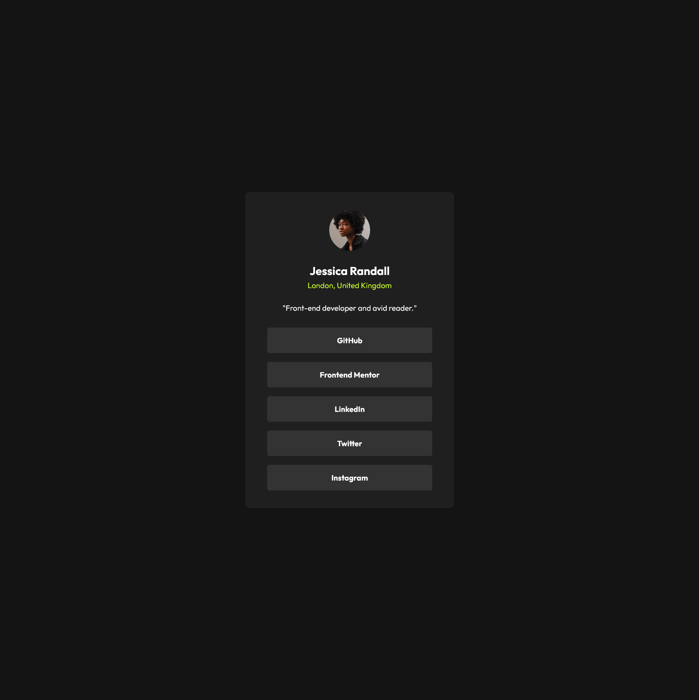

# Frontend Mentor - QR code component solution

This is a solution to the [QR code component challenge on Frontend Mentor](https://www.frontendmentor.io/challenges/qr-code-component-iux_sIO_H). Frontend Mentor challenges help you improve your coding skills by building realistic projects. 

## Table of contents

- [Overview](#overview)
  - [Screenshot](#screenshot)
  - [Links](#links)
- [My process](#my-process)
  - [Built with](#built-with)
  - [What I learned](#what-i-learned)
  - [Continued development](#continued-development)
- [Author](#author)

## Overview

### Screenshot

### Links

- Solution URL: [Add solution URL here](https://github.com/TIC0NDER0GA/frontend_mentor)

## My process
1. Laid out all the parts of the component as basic html
2. grouped togther elements based on their relationship e.g. the image, title text, and description text
3. fixed the positioning of the elements made sure it was column for the group elements and body then centered the children
4. Changed the color of the body and qr card component to make it easier to see how I would need to add padding for the elements within the card 
5. Rounded the edges, fixed the type font, and font colors to match the image

### Built with

- Semantic HTML5 markup
- Flexbox
- [TailwindCSS](https://tailwindcss.com/docs/installation/using-vite)
- [React](https://reactjs.org/) - JS library
- [Next.js](https://nextjs.org/) - React framework
- [Vite](https://vite.dev/guide/)

### What I learned

I learned the different keyowrds used for tailwind css since it was my first time using it. 

### Continued development

Be able to come up with my own themes and components. Become more design oriented with colors and layouts. Remember the terms used for frontend markup and the different measurements other than px.

